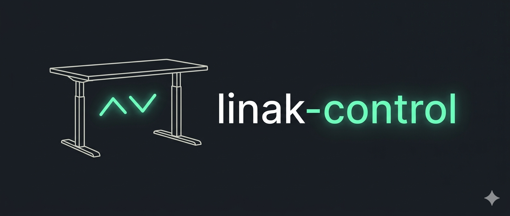
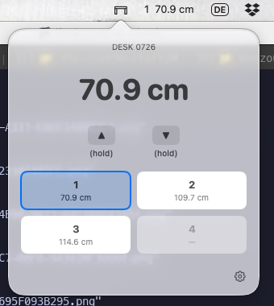
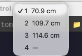

<p align="center">
  
</p>

# linak-control

macOS menu bar app and CLI for controlling LINAK DPG1C standing desks via Bluetooth Low Energy.

## Features

- **Menu bar app** with two zones: desk icon (popover) and height/preset text (dropdown)
- **Preset recall**: store and recall 4 height positions via single/double-click
- **Manual movement**: hold-to-move up/down buttons, or auto-run mode (tap to start/stop)
- **Live height display**: real-time height with configurable desk offset
- **Settings**: display unit (cm/inch), movement mode, preset management, desk offset
- **Auto-reconnect**: reconnects on disconnect with exponential backoff, plus system wake detection
- **CLI tool** (`deskctl`): status, height, preset, and move commands via IPC

## Requirements

- macOS 14+ (Sonoma)
- Xcode 15+ with Swift 5.9
- [xcodegen](https://github.com/yonaskolb/XcodeGen) (`brew install xcodegen`)
- A LINAK DPG1C-compatible desk with Bluetooth controller

## Quick Start

```bash
# Build and launch the debug app
./run.sh

# Build and launch with clean config (first-run pairing)
./run.sh --clean
```

On first launch, the app scans for nearby LINAK desks. Select your desk to pair. The desk's Bluetooth controller LED should be in pairing mode (blue).

## Screenshots

<p align="center">
  
  
</p>

Regenerate from a clean state with the desk powered on and paired:

```bash
./scripts/take-screenshots.sh
```

This runs the `LinakControlUITests` XCUITest target, which opens each menu bar zone and captures `XCTAttachment` screenshots. The script extracts the attachments from the result bundle and writes PNGs into `docs/screenshots/`.

The first run will prompt for **Accessibility permission** for the XCUITest runner (System Settings → Privacy & Security → Accessibility). Grant it once; subsequent runs are silent.

## Install

```bash
# Build release, install LinakControl.app to /Applications, install deskctl to /usr/local/bin, then launch
./install.sh

# Install into a custom location instead of /Applications
./install.sh ~/Applications
```

The script stops any running instance, regenerates the Xcode project, builds a Release `.app`, installs the CLI (`deskctl`, may prompt for sudo for `/usr/local/bin`), and opens the app so you can confirm the menu bar icon appears. It refuses to run if `xcodebuild` or `xcodegen` are missing and tells you how to install them.

## Build

```bash
make help               # Show all targets
make xcode-build-debug  # Build .app bundle (debug)
make xcode-build        # Build .app bundle (release)
make build              # Build CLI binary via SPM
make test               # Run test suite (385 tests)
make install            # Install deskctl to /usr/local/bin
make clean              # Remove build artifacts
```

The `.app` bundle is built via Xcode (xcodegen generates the project from `project.yml`). A proper bundle is required for CoreBluetooth entitlements, `Info.plist` embedding, and `SMAppService` login item support.

## Architecture

```
LinakControl/
  Sources/
    App/                    # AppDelegate, SwiftUI entry point
    LinakControlKit/
      BLE/                  # CoreBluetooth, DPG1C protocol, handshake
      Config/               # AppConfig (JSON), ConfigStore
      Core/                 # DeskManager (actor), movement, presets, reconnection
      IPC/                  # Unix socket server/client for CLI communication
      UI/                   # SwiftUI views, DeskViewModel, MenuBarController
      Util/                 # HeightConverter, FileLog, TimedStreamBuffer, Clock
    deskctl/                # CLI tool (swift-argument-parser)
  Tests/
    LinakControlTests/      # 385 tests across BLE, Core, UI, IPC, Integration
```

**Key design decisions:**
- `DeskManager` is a Swift actor (single source of truth for desk state)
- BLE layer uses protocol abstraction (`BLEControllerProtocol`) for testability
- Height values from BLE are raw (relative to desk zero); display adds user-configured offset
- DPG1C session requires USER_ID read before queries respond
- Heartbeat suppressed during active movement (shared characteristic 0x0031)

## Configuration

Settings are stored in `~/Library/Application Support/LinakControl/config.json`:

| Setting | Description | Default |
|---------|-------------|---------|
| `desk_offset_mm` | Base height offset in mm (lowest desk position from floor) | 0 |
| `unit` | Display unit: `cm` or `inch` | `cm` |
| `auto_run_up` / `auto_run_down` | Movement mode: `manual` (hold) or `auto` (tap) | `manual` |
| `start_at_login` | Register as login item | `false` |
| `hotkeys_enabled` | Global keyboard shortcuts | `false` |
| `preset_labels` | Optional labels for presets 1-4 | `[null, null, null, null]` |

## Debug Logging

In debug builds, logs are written to `~/Library/Logs/LinakControl/debug.log`. The file is truncated at app launch and capped at 1 MB. Logs include BLE state changes, handshake steps, movement commands, and UI state transitions.

```bash
# Watch logs in real-time
tail -f ~/Library/Logs/LinakControl/debug.log
```

## Protocol Notes

The LINAK DPG1C desk communicates via four BLE services:

| Service | UUID (short) | Purpose |
|---------|-------------|---------|
| Control | 0x0001 | Movement commands (up/down/stop/wake) |
| DPG | 0x0010 | Configuration queries (capabilities, presets, user ID) |
| Reference Output | 0x0020 | Height notifications, output mask |
| Reference Input | 0x0030 | Move-to targets, heartbeat |

DPG queries use 3-byte read format `[0x7F, cmd, 0x00]` and require USER_ID session activation before responding. Height values are uint16 in 0.1mm units (little-endian). See `DeskCharacteristics.swift` and `DeskProtocol.swift` for full protocol details.

## Acknowledgements

The BLE protocol implementation is based on reverse-engineering work from these open-source projects:

- [linak-controller](https://github.com/rhyst/linak-controller) -- Python desk controller by rhyst. Key reference for DPG1C handshake, USER_ID activation, and base offset parsing.
- [LinakDeskApp](https://github.com/anetczuk/LinakDeskApp) -- Linux desktop app by anetczuk. Reference for BLE service UUIDs, characteristics, and command bytes.
- [linak-desk-spec](https://github.com/anson-vandoren/linak-desk-spec) -- Protocol specification by anson-vandoren. Detailed reverse-engineered documentation of the DPG1C wire format.
- [hass-linak-dpg](https://github.com/Laeborg/hass-linak-dpg) -- Home Assistant integration by Laeborg.
- [linak_desk](https://github.com/mdrwiega/linak_desk) -- Home Assistant component by mdrwiega.

See [docs/spec.md](docs/spec.md) for the full project specification.

## License

Released under the [MIT License](LICENSE) © 2026 Marcus Breiden.

Third-party dependencies and protocol attributions are listed in [THIRD_PARTY_LICENSES.md](THIRD_PARTY_LICENSES.md).
