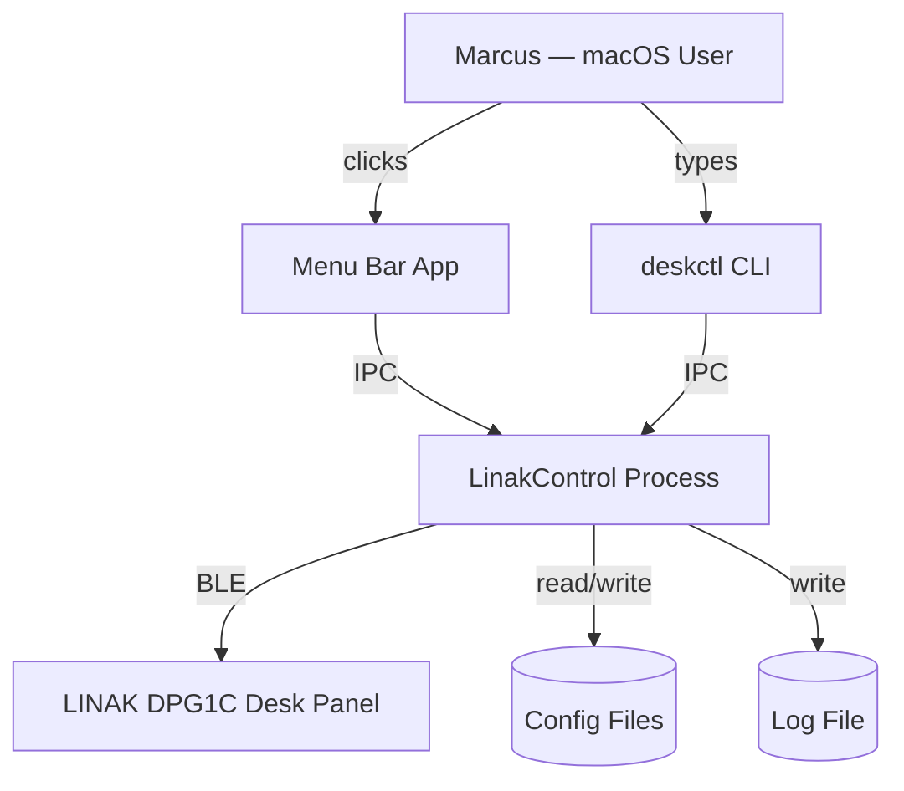
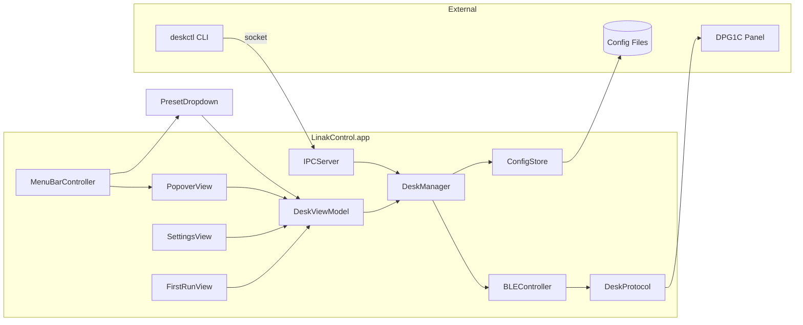
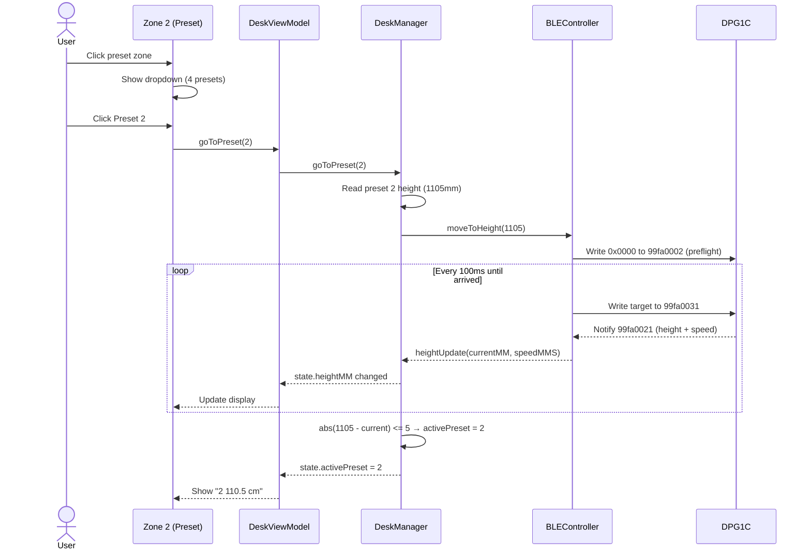
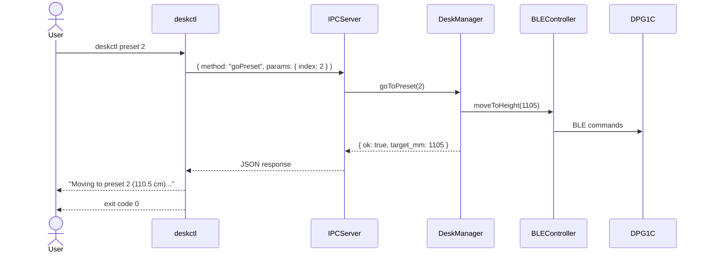
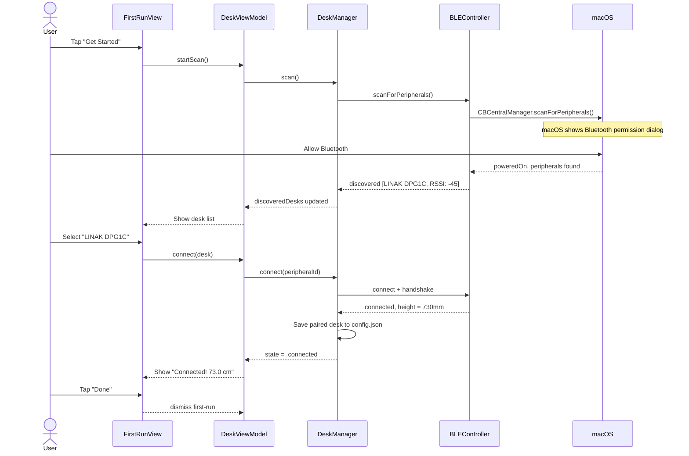
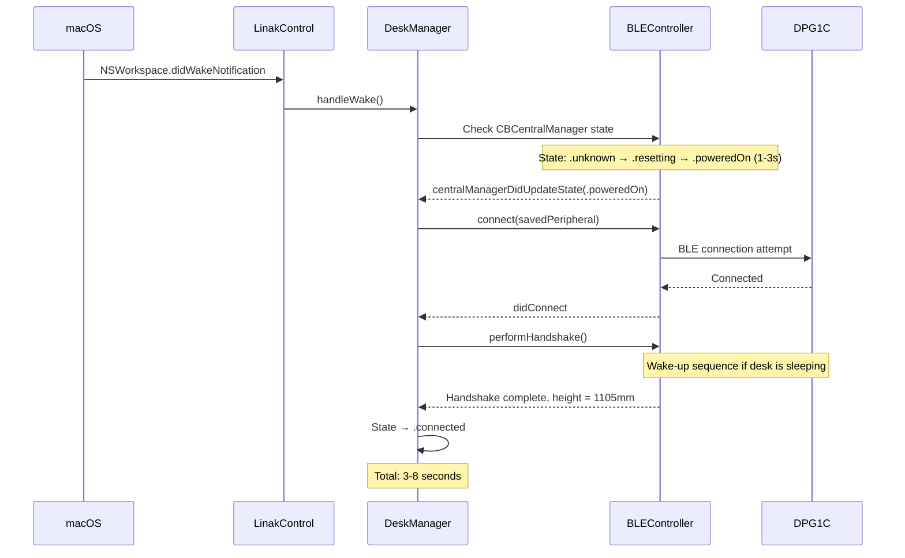
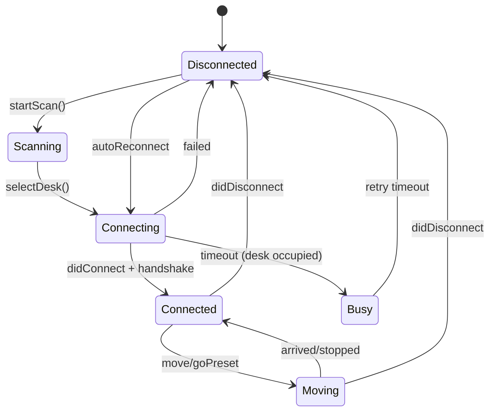

# Solution Design Document

## Validation Checklist

### CRITICAL GATES (Must Pass)

- [x] All required sections are complete
- [x] No [NEEDS CLARIFICATION] markers remain
- [x] Architecture pattern is clearly stated with rationale
- [x] **All architecture decisions confirmed by user**
- [x] Every interface has specification

### QUALITY CHECKS (Should Pass)

- [x] All context sources are listed with relevance ratings
- [x] Project commands are discovered from actual project files
- [x] Constraints → Strategy → Design → Implementation path is logical
- [x] Every component in diagram has directory mapping
- [x] Error handling covers all error types
- [x] Quality requirements are specific and measurable
- [x] Component names consistent across diagrams
- [x] A developer could implement from this design
- [x] Implementation examples use actual schema column names (not pseudocode), verified against migration files
- [x] Complex queries include traced walkthroughs with example data showing how the logic evaluates

---

## Constraints

CON-1 **Platform & Language:** macOS 13+ (Ventura), Apple Silicon only. Swift 5.9+, SwiftUI, CoreBluetooth. Single Xcode project.

CON-2 **No Developer Account:** No paid Apple Developer Program. Ad-hoc code signing. No App Store distribution. Gatekeeper bypass via `xattr -dr com.apple.quarantine`.

CON-3 **BLE Single Connection:** DPG1C supports exactly one BLE connection at a time. App replaces the phone app entirely.

CON-4 **Local Only:** No cloud, no network, no telemetry. All data stored in `~/Library/Application Support/LinakControl/`. IPC via Unix domain socket only.

CON-5 **Resource Budget:** Idle CPU < 0.1%, memory < 20 MB. Background process must be invisible to the user.

CON-6 **BLE Protocol:** Reverse-engineered from open-source community (LinakDeskApp, linak-controller, hass-linak-dpg). Protocol is stable across DPG1C firmware versions (2020-2026) but UUIDs should be configurable as a safety net.

## Implementation Context

### Required Context Sources

#### Documentation Context
```yaml
- doc: linak-control-spec.md
  relevance: HIGH
  why: "Original German specification with architecture overview, API sketches, CLI spec"

- doc: docs/XDD/specs/001-linak-dpg1c-desk-control/requirements.md
  relevance: CRITICAL
  why: "PRD with 17 features, 48 acceptance criteria — defines what we build"

- doc: docs/XDD/specs/001-linak-dpg1c-desk-control/mockups.md
  relevance: HIGH
  why: "Approved UI mockups — two-zone menu bar, popover, settings, first-run flow"
```

#### Code Context
```yaml
# External reference implementations
- repo: github.com/anetczuk/LinakDeskApp
  relevance: CRITICAL
  why: "Most complete BLE protocol reference for DPG1C — UUIDs, commands, handshake"

- repo: github.com/rhyst/linak-controller
  relevance: HIGH
  why: "Python implementation with DPG1C support, protocol details"

- repo: github.com/Laeborg/hass-linak-dpg
  relevance: HIGH
  why: "Home Assistant integration — wake-up sequence, reconnection patterns"

- repo: github.com/anson-vandoren/linak-desk-spec
  relevance: HIGH
  why: "Reverse-engineered protocol specification from APK decompilation"
```

#### External APIs
```yaml
- service: CoreBluetooth Framework
  doc: Apple Developer Documentation
  relevance: CRITICAL
  why: "Primary BLE communication framework — CBCentralManager, CBPeripheral"

- service: Swift ArgumentParser
  doc: github.com/apple/swift-argument-parser
  relevance: HIGH
  why: "CLI argument parsing for deskctl tool"
```

### Implementation Boundaries

- **Must Preserve**: DPG1C BLE protocol compatibility — byte sequences, UUIDs, handshake order
- **Can Modify**: Everything — this is a greenfield project
- **Must Not Touch**: Desk firmware — all communication is read/write via documented BLE characteristics

### External Interfaces

#### System Context Diagram



#### Interface Specifications

```yaml
# Inbound Interfaces
inbound:
  - name: "Menu Bar UI"
    type: In-process (SwiftUI views within the app)
    format: Swift method calls / @Observable binding
    authentication: None (same process)
    data_flow: "User actions → DeskManager actor"

  - name: "CLI Tool (deskctl)"
    type: Unix Domain Socket (AF_UNIX)
    format: Length-prefixed JSON
    authentication: Unix file permissions (0600)
    data_flow: "CLI commands → daemon → BLE → desk"

# Outbound Interfaces
outbound:
  - name: "LINAK DPG1C Desk Panel"
    type: Bluetooth Low Energy (BLE)
    format: Binary (little-endian uint16 commands)
    authentication: BLE Just Works pairing (no PIN)
    data_flow: "Movement commands, preset read/write, height notifications"
    criticality: CRITICAL

  - name: "macOS Notification Center"
    type: UNUserNotificationCenter
    format: UNNotification
    authentication: None
    data_flow: "Connection state change alerts"
    criticality: LOW

# Data Interfaces
data:
  - name: "Configuration"
    type: JSON files
    connection: FileManager
    data_flow: "Settings, profiles, paired desk identifier"

  - name: "Socket"
    type: Unix Domain Socket
    connection: POSIX socket API
    data_flow: "IPC between CLI and app process"
```

### Project Commands

```bash
# Core Commands
Build:    xcodebuild -scheme LinakControl -configuration Release
Dev:      open LinakControl.xcodeproj  # run from Xcode
Test:     xcodebuild test -scheme LinakControl -destination 'platform=macOS'
Lint:     swiftlint

# Installation
Install:  cp -r build/Release/LinakControl.app /Applications/
          cp build/Release/deskctl /usr/local/bin/
Unsign:   xattr -dr com.apple.quarantine /Applications/LinakControl.app

# Daemon
Start:    open /Applications/LinakControl.app
Stop:     deskctl service stop
Status:   deskctl service status
```

## Solution Strategy

- **Architecture Pattern:** Single-process menu bar app with in-process BLE management and an external Unix socket IPC server for CLI access. The menu bar app IS the daemon — no separate background process.
- **Integration Approach:** Greenfield project. CLI connects to the running app via Unix socket. BLE managed exclusively by the app process via CoreBluetooth.
- **Justification:** A single process eliminates cross-process BLE delegation, simplifies lifecycle management, and matches the pattern used by successful macOS menu bar utilities (iStatMenus, Bartender). The CLI is the only external client and connects via socket. For a personal-use tool, the added complexity of a separate daemon is not justified.
- **Key Decisions:** See Architecture Decisions section (ADR-1 through ADR-7).

## Building Block View

### Components



### Directory Map

**Target**: LinakControl (macOS App)
```
LinakControl/
├── LinakControl.xcodeproj
├── Sources/
│   ├── App/
│   │   ├── LinakControlApp.swift           # NEW: @main, LSUIElement, app lifecycle
│   │   └── Info.plist                     # NEW: NSBluetoothAlwaysUsageDescription
│   ├── UI/
│   │   ├── MenuBarController.swift        # NEW: NSStatusItem, two-zone setup
│   │   ├── PresetDropdownView.swift       # NEW: Zone 2 preset quick-switch
│   │   ├── PopoverView.swift              # NEW: Main popover (height, buttons, presets)
│   │   ├── MovementControlView.swift      # NEW: Up/down buttons with hold/auto modes
│   │   ├── PresetGridView.swift           # NEW: 2x2 preset grid in popover
│   │   ├── SettingsView.swift             # NEW: Settings panel (push/pop in popover)
│   │   ├── FirstRunView.swift             # NEW: Welcome → scan → connect → done
│   │   └── DeskViewModel.swift            # NEW: @Observable, binds UI to DeskManager
│   ├── BLE/
│   │   ├── BLEControllerProtocol.swift    # NEW: Protocol for DeskManager dependency injection + testing
│   │   ├── BLEController.swift            # NEW: CBCentralManager + CBPeripheral wrapper (conforms to BLEControllerProtocol)
│   │   ├── MockBLEController.swift        # NEW: Mock for tests — pre-scripted responses, write capture
│   │   ├── DeskProtocol.swift             # NEW: DPG1C command encoding/decoding
│   │   └── DeskCharacteristics.swift      # NEW: UUID constants, characteristic map
│   ├── Core/
│   │   ├── DeskManager.swift              # NEW: Actor — central state, coordinates BLE + IPC
│   │   └── DeskState.swift                # NEW: Height, connection, presets, movement state
│   ├── IPC/
│   │   ├── IPCServer.swift                # NEW: Unix socket listener, request routing
│   │   └── IPCProtocol.swift              # NEW: Typed message enums, framing helpers
│   ├── Config/
│   │   ├── ConfigStore.swift              # NEW: Read/write config.json
│   │   └── ConfigModels.swift             # NEW: Codable settings struct (single file, no profiles)
│   └── Util/
│       ├── Logger.swift                   # NEW: os.Logger wrapper (#if DEBUG for verbose BLE frames)
│       └── HeightConverter.swift          # NEW: mm → cm/inch conversion
├── Sources/deskctl/
│   ├── DeskctlCommand.swift               # NEW: Root command (ArgumentParser)
│   ├── IPCClient.swift                    # NEW: Unix socket client (deskctl-only, not shared with app)
│   ├── StatusCommand.swift                # NEW: deskctl status [--json]
│   ├── HeightCommand.swift                # NEW: deskctl height [--json]
│   ├── MoveCommand.swift                  # NEW: deskctl up/down [--auto|--manual]
│   ├── PresetCommand.swift                # NEW: deskctl preset <1-4> [--save]
│   ├── ServiceCommand.swift               # NEW: deskctl service status/stop/install
│   └── Formatters.swift                   # NEW: Table + JSON output + JSON error formatting to stderr
├── Tests/
│   ├── BLETests/
│   │   ├── DeskProtocolTests.swift        # NEW: Command encoding/decoding
│   │   ├── HeightParsingTests.swift       # NEW: Raw bytes → height_mm conversion
│   │   └── BLEControllerTests.swift       # NEW: State machine, handshake, mock-based
│   ├── CoreTests/
│   │   └── DeskStateTests.swift           # NEW: State transitions, preset matching, tolerance
│   ├── IPCTests/
│   │   ├── IPCProtocolTests.swift         # NEW: Message framing, typed enum serialization
│   │   └── IPCServerTests.swift           # NEW: Request routing, error responses
│   └── ConfigTests/
│       └── ConfigStoreTests.swift         # NEW: Load, save, defaults
└── Resources/
    └── Assets.xcassets/                   # NEW: Menu bar icons (desk glyph)
```

### Interface Specifications

#### IPC Protocol (Unix Domain Socket)

**Socket path:** `~/Library/Application Support/LinakControl/linakcontrol.sock`

**Socket lifecycle:** On startup: (1) try `connect()` to existing socket — if succeeds, another instance is running, exit with error; (2) if `connect()` fails with ECONNREFUSED, `unlink()` the stale socket; (3) `bind()` and `listen()`. On shutdown/SIGTERM/SIGINT: `unlink()` the socket file. Directory created with mode `0700`, socket created with mode `0600`.

**Framing:** Each message is length-prefixed (max payload: 64 KB):
```
[4 bytes: uint32 big-endian payload length][UTF-8 JSON payload]
```

**Request format:**
```json
{
  "id": "uuid-string",
  "method": "getStatus | move | stop | goPreset | savePreset",
  "params": {}
}
```

**Response format:**
```json
{
  "id": "uuid-string",
  "result": {}
}
```

**Error format:**
```json
{
  "id": "uuid-string",
  "error": { "code": 3, "message": "desk not connected" }
}
```

#### IPC Methods

| Method | Params | Result | Description |
|--------|--------|--------|-------------|
| `getStatus` | — | `{ connected, deskName, height_mm, height_display, unit, presets, activePreset }` | Full status snapshot |
| `move` | `{ direction: "up"\|"down", mode?: "auto"\|"manual" }` | `{ ok: true }` | Start movement |
| `stop` | — | `{ ok: true }` | Stop movement |
| `goPreset` | `{ index: 1-4 }` | `{ ok: true, target_mm: int }` | Move to preset (fire-and-forget — returns immediately, desk begins moving) |
| `savePreset` | `{ index: 1-4 }` | `{ ok: true, height_mm: int }` | Save current height to preset |

Settings are changed via the menu bar UI only. No CLI settings commands.

#### IPC Error Codes

| Code | Meaning | CLI Exit Code |
|------|---------|---------------|
| 1 | General error | 1 |
| 2 | Daemon not running (socket not found) | 2 |
| 3 | Desk not connected | 3 |
| 5 | Timeout (command took too long) | 5 |
| 10 | Invalid request (bad method or params) | 1 |

#### CLI Error Output

When `--json` is passed to any CLI command, errors are written to stderr as JSON:
```json
{ "error": 3, "message": "desk not connected" }
```

Without `--json`, errors are plain text to stderr:
```
error: desk not connected
```

#### Data Storage Changes

```yaml
# All files in ~/Library/Application Support/LinakControl/

File: config.json
  paired_desk_uuid: string          # CoreBluetooth peripheral identifier
  paired_desk_name: string          # Human-readable desk name
  unit: "cm" | "inch"              # Display unit, default "cm"
  auto_run_up: "manual" | "auto"   # Up button mode, default "manual"
  auto_run_down: "manual" | "auto" # Down button mode, default "manual"
  start_at_login: boolean          # Register as login item, default false
  hotkeys_enabled: boolean         # Global hotkeys, default false
  preset_1_label: string?          # e.g. "Sitting", optional local metadata
  preset_2_label: string?          # e.g. "Standing"
  preset_3_label: string?
  preset_4_label: string?
```

#### Application Data Models

```swift
// Central desk state — source of truth, owned by DeskManager actor
struct DeskState {
    var connectionState: ConnectionState  // .disconnected, .connecting, .connected, .busy
    var deskName: String?
    var heightMM: Int?                    // Current height in 0.1mm raw → mm
    var speedMMS: Int?                    // Speed in mm/s, negative = down
    var isMoving: Bool
    var moveDirection: MoveDirection?     // .up, .down, nil
    var targetPreset: Int?               // Preset index being moved to (1-4), nil if manual
    var presets: [PresetPosition]         // 4 slots, read from desk firmware
    var activePreset: Int?               // Which preset matches current height (within 5mm)
}

enum ConnectionState {
    case disconnected
    case scanning
    case connecting
    case connected
    case busy                             // Another device holds the connection
}

struct PresetPosition {
    let index: Int                        // 1-4
    var heightMM: Int?                    // nil = unset
    var label: String?                    // Local metadata from config.json (preset_N_label)
}

// IPC message types — typed per method, no AnyCodable
enum IPCMethod: String, Codable {
    case getStatus, move, stop, goPreset, savePreset
}

struct IPCRequest: Codable {
    let id: String
    let method: IPCMethod
    let params: IPCParams?
}

enum IPCParams: Codable {
    case move(direction: String, mode: String?)     // "up"/"down", "auto"/"manual"
    case preset(index: Int)                         // 1-4
}

struct IPCResponse: Codable {
    let id: String
    let result: IPCResult?
    let error: IPCError?
}

enum IPCResult: Codable {
    case status(StatusResult)
    case ok(target_mm: Int?)
}

struct StatusResult: Codable {
    let connected: Bool
    let deskName: String?
    let height_mm: Int?
    let height_display: String?
    let unit: String
    let presets: [PresetInfo]
    let activePreset: Int?
}

struct IPCError: Codable {
    let code: Int
    let message: String
}
```

#### Integration Points

```yaml
# Inter-Component Communication
- from: deskctl (CLI)
  to: LinakControl.app (IPCServer)
  protocol: Unix Domain Socket (AF_UNIX)
  endpoints: [getStatus, move, stop, goPreset, savePreset]
  data_flow: "CLI sends JSON requests, receives JSON responses"

- from: DeskViewModel (UI)
  to: DeskManager (Core)
  protocol: Swift async method calls (in-process)
  endpoints: [connect, disconnect, moveUp, moveDown, stop, goToPreset, savePreset, updateSettings]
  data_flow: "UI calls actor methods, observes published state"

- from: DeskManager (Core)
  to: BLEController (BLE)
  protocol: Swift async method calls (in-process)
  endpoints: [scan, connect, disconnect, write, subscribe to notifications]
  data_flow: "Core orchestrates BLE commands, receives notifications"

# External System Integration
- from: BLEController
  to: LINAK DPG1C Desk Panel
  protocol: Bluetooth Low Energy
  services: [Control 0x0001, DPG 0x0010, RefOutput 0x0020, RefInput 0x0030]
  data_flow: "Binary commands out, height/status notifications in"
  criticality: CRITICAL
```

### Implementation Examples

#### Example: BLE Height Notification Parsing

**Why this example:** The height value arrives as 4 raw bytes from the BLE characteristic. Incorrect parsing breaks the entire UI. This shows the exact byte layout and conversion.

```swift
/// Parse height notification from characteristic 99fa0021
/// Payload: 4 bytes, little-endian
///   [0:1] position (uint16) in 0.1mm units
///   [2:3] speed (int16) in raw units
func parseHeightNotification(_ data: Data) -> (heightMM: Int, speedMMS: Int)? {
    guard data.count >= 4 else { return nil }

    let rawPosition = data.withUnsafeBytes { $0.load(fromByteOffset: 0, as: UInt16.self) }
    let rawSpeed = data.withUnsafeBytes { $0.load(fromByteOffset: 2, as: Int16.self) }

    // Raw value is in 0.1mm increments. Divide by 10 for mm.
    let heightMM = Int(UInt16(littleEndian: rawPosition)) / 10
    let speedMMS = Int(Int16(littleEndian: rawSpeed))

    // Sanity check: desk range is ~600mm to ~1300mm
    guard (500...1500).contains(heightMM) else { return nil }

    return (heightMM, speedMMS)
}
```

**Traced walkthrough:**
| Raw bytes (hex) | rawPosition | heightMM | rawSpeed | Interpretation |
|---|---|---|---|---|
| `52 2B 00 00` | 0x2B52 = 11090 | 1109 (110.9 cm) | 0 | Stationary at 110.9 cm |
| `52 2B 1A 00` | 0x2B52 = 11090 | 1109 | 26 | Moving up at ~26 mm/s |
| `D2 1C F0 FF` | 0x1CD2 = 7378 | 737 (73.7 cm) | -16 | Moving down at ~16 mm/s |
| `00 00 00 00` | 0 | 0 | 0 | Invalid — rejected by range check |

#### Example: DPG1C Handshake Sequence

**Why this example:** The handshake MUST execute in exact order after every connection. Skipping steps or reordering causes the desk to ignore commands.

```swift
/// Full DPG1C initialization sequence after CBPeripheral services are discovered
func performHandshake(peripheral: CBPeripheral) async throws {
    let control = characteristic(uuid: "99fa0002")  // Command (Write)
    let dpg     = characteristic(uuid: "99fa0011")  // DPG (Read/Write/Notify)
    let height  = characteristic(uuid: "99fa0021")  // Height (Read/Notify)
    let status  = characteristic(uuid: "99fa0003")  // Status (Read/Notify)
    let mask    = characteristic(uuid: "99fa0029")  // Mask (Read)

    // Step 1: Enable notifications on status, DPG, and height
    peripheral.setNotifyValue(true, for: status)
    peripheral.setNotifyValue(true, for: dpg)
    peripheral.setNotifyValue(true, for: height)

    // Step 2: Read output mask (should return 0x01)
    let maskValue = try await read(mask)
    guard maskValue == Data([0x01]) else {
        throw DeskError.unexpectedMaskValue(maskValue)
    }

    // Step 3: Query capabilities via DPG characteristic
    let capabilitiesQueries: [Data] = [
        Data([0x7F, 0x80]),  // GET_CAPABILITIES
        Data([0x7F, 0x86]),  // GET_CAPABILITIES_EXTENDED
        Data([0x7F, 0x81]),  // GET_USER_ID
        Data([0x7F, 0x88]),  // GET_DESK_OFFSET
        Data([0x7F, 0x89]),  // GET_MEMORY_POSITION_1
        Data([0x7F, 0x8A]),  // GET_MEMORY_POSITION_2
        Data([0x7F, 0x8B]),  // GET_MEMORY_POSITION_3
        Data([0x7F, 0x8C]),  // GET_MEMORY_POSITION_4
    ]

    for query in capabilitiesQueries {
        peripheral.writeValue(query, for: dpg, type: .withResponse)
        try await waitForDPGResponse(timeout: 1.0)  // Wait for notification
    }

    // Step 4: Parse capabilities (response to 0x7F 0x80)
    // Byte 2 of response: bit0-2=presetCount, bit3=autoUp, bit4=autoDown
}
```

#### Example: Preset Matching Logic

**Why this example:** The 5mm tolerance and edge cases (multiple presets at same height, pass-through during movement) are critical to correct UX.

```swift
/// Determine which preset (if any) matches the current height
/// Returns nil if no preset matches within tolerance
func activePreset(height heightMM: Int, presets: [PresetPosition], isMoving: Bool) -> Int? {
    // Rule 5 from PRD: No active preset while desk is moving
    guard !isMoving else { return nil }

    let toleranceMM = 5

    // Find all matching presets (Rule: multiple can match if same height)
    let matches = presets.filter { preset in
        guard let presetHeight = preset.heightMM else { return false }
        return abs(presetHeight - heightMM) <= toleranceMM
    }

    // Return lowest-index match (deterministic for UI highlighting)
    return matches.min(by: { $0.index < $1.index })?.index
}
```

**Traced walkthrough:**
| heightMM | Preset heights | isMoving | Result | Why |
|---|---|---|---|---|
| 1105 | [730, 1105, 900, 1200] | false | 2 | Exact match for preset 2 |
| 1103 | [730, 1105, 900, 1200] | false | 2 | Within 5mm tolerance |
| 1105 | [730, 1105, 900, 1200] | true | nil | Moving — no highlight (Rule 5) |
| 730 | [730, nil, 730, 1200] | false | 1 | Both 1 and 3 match — lowest index wins |
| 850 | [730, 1105, 900, 1200] | false | nil | No preset within 5mm |

#### Example: Move-to-Preset Control Loop

**Why this example:** There is no "go to preset N" BLE command. The app must drive the desk to the target height using repeated writes to the Reference Input characteristic. This is the most complex BLE interaction.

```swift
/// Move desk to a target height by repeatedly writing to Reference Input (99fa0031)
func moveToHeight(targetMM: Int, peripheral: CBPeripheral) async throws {
    // Safety guard: reject targets outside known desk range
    guard (600...1350).contains(targetMM) else {
        throw DeskError.targetOutOfRange(targetMM)
    }

    let control  = characteristic(uuid: "99fa0002")
    let refInput = characteristic(uuid: "99fa0031")

    // Preflight: write 0x0000 to control to enable Reference Input
    peripheral.writeValue(Data([0x00, 0x00]), for: control, type: .withResponse)
    try await Task.sleep(for: .milliseconds(100))

    // Target in raw desk units (0.1mm)
    let rawTarget = UInt16(targetMM * 10)
    let targetBytes = withUnsafeBytes(of: rawTarget.littleEndian) { Data($0) }

    // Repeat target write until desk arrives or timeout
    let startTime = ContinuousClock.now
    let timeout: Duration = .seconds(30)

    while ContinuousClock.now - startTime < timeout {
        // Check if we've arrived (within 5mm)
        if let current = currentHeightMM, abs(current - targetMM) <= 5 {
            break
        }

        // Check for cancellation (user tapped different preset or stop)
        try Task.checkCancellation()

        // Write target position — desk moves for ~1s per write
        peripheral.writeValue(targetBytes, for: refInput, type: .withoutResponse)
        try await Task.sleep(for: .milliseconds(100))
    }
}
```

## Runtime View

### Primary Flow: Preset Quick-Switch (Most Common Action)

1. User clicks Zone 2 (preset area) in menu bar
2. PresetDropdownView shows 4 presets with heights and active checkmark
3. User clicks Preset 2
4. DeskViewModel calls `DeskManager.goToPreset(2)`
5. DeskManager reads preset 2 height from `DeskState.presets[1]`
6. DeskManager calls `BLEController.moveToHeight(targetMM:)`
7. BLEController writes target to `99fa0031` in a loop
8. Height notifications arrive on `99fa0021` at 5-10 Hz
9. DeskState updates → DeskViewModel publishes → UI re-renders (live height)
10. Desk arrives within 5mm → DeskManager sets `activePreset = 2`
11. Menu bar Zone 2 updates to show "2  110.5 cm"



### Primary Flow: CLI Preset Command

1. User runs `deskctl preset 2`
2. CLI connects to `~/Library/Application Support/LinakControl/linakcontrol.sock`
3. CLI sends `{ "id": "...", "method": "goPreset", "params": { "index": 2 } }`
4. IPCServer routes to DeskManager
5. DeskManager executes same flow as menu bar (see above)
6. IPCServer sends `{ "id": "...", "result": { "ok": true, "target_mm": 1105 } }`
7. CLI prints `Moving to preset 2 (110.5 cm)...` and exits with code 0



### Secondary Flow: First-Run Pairing



### Secondary Flow: Wake from Sleep Reconnection



### Error Handling

**BLE disconnection during movement:**
- Desk hardware stops the motor automatically (built-in safety)
- DeskManager sets `connectionState = .disconnected`, `isMoving = false`
- UI shows "Disconnected — Reconnecting..."
- DeskManager calls `connect()` → exponential backoff (1s, 2s, 4s, 8s, max 60s)
- Movement is NOT auto-resumed after reconnect (user must re-trigger)

**Desk busy (another device connected):**
- CoreBluetooth connection attempt hangs (no explicit rejection)
- Timeout after 10 seconds → DeskManager sets `connectionState = .busy`
- UI shows "Desk is connected to another device. Quit the LINAK app on your phone and try again."
- Retry button re-attempts connection

**CLI daemon not running:**
- CLI attempts socket connect → `ECONNREFUSED` or `ENOENT`
- Prints `error: daemon not running — start LinakControl.app first` to stderr
- Exits with code 2

**Invalid preset (unset):**
- User taps a preset with `heightMM = nil`
- UI shows toast: "No height saved. Move the desk to a position and save it in Settings."
- CLI: prints error to stderr, exits with code 1

**Wake-up failure:**
- 3 attempts with 300ms delays, each writing `FE 00` then `FF 00` to `99fa0002`
- After 3 failures: DeskManager sets `state.wakeUpFailed = true`
- UI shows "Desk not responding" with manual retry button
- User can try unplugging and re-plugging the desk panel

### Complex Logic: Conditional Heartbeat

The heartbeat keeps the desk awake but pauses after 10 minutes of no user interaction to allow the desk to enter its natural sleep mode. This aligns with Feature 11 (sleep/wake recovery).

```
ALGORITHM: Conditional Heartbeat
INPUT: connected peripheral, lastUserAction timestamp
OUTPUT: desk stays awake during active use; sleeps after idle

1. START heartbeat timer (every 1 second)
2. WHILE connected:
   a. IF (now - lastUserAction) > 10 minutes:
      - PAUSE heartbeat (desk will enter sleep mode naturally)
      - CONTINUE loop (stay connected, just stop writing heartbeat)
   b. ELSE:
      - Write 0x01 0x80 to 99fa0031 (Reference Input)
      - IF write fails:
        - Increment failure count
        - IF failure count >= 3: trigger reconnection
      - RESET failure count on success
   c. WAIT 1 second
3. ON user action (move, preset, CLI command):
   - UPDATE lastUserAction = now
   - IF heartbeat paused AND desk sleeping:
     - Run wake-up sequence (FE 00 → FF 00) before executing command
   - RESUME heartbeat
4. ON disconnect: cancel heartbeat timer
5. ON reconnect: restart heartbeat after handshake completes
```

## Deployment View

### Single Application Deployment

- **Environment:** macOS 13+ (Ventura), Apple Silicon. Runs as a menu bar app (LSUIElement = YES).
- **Configuration:** No environment variables. All config in `~/Library/Application Support/LinakControl/config.json`. First-run creates defaults.
- **Dependencies:** No external services. Only system frameworks (CoreBluetooth, SwiftUI, UserNotifications).
- **Performance:** Idle: < 0.1% CPU, < 20 MB RAM. Active (desk moving): < 0.5% CPU.

### Build & Install

```bash
# Build
xcodebuild -scheme LinakControl -configuration Release \
  -derivedDataPath build/ \
  CODE_SIGN_IDENTITY="-" \
  CODE_SIGNING_REQUIRED=YES

# Install app
cp -r build/Build/Products/Release/LinakControl.app /Applications/
xattr -dr com.apple.quarantine /Applications/LinakControl.app

# Install CLI
cp build/Build/Products/Release/deskctl /usr/local/bin/

# Optional: Install LaunchAgent for auto-start
# (alternatively, use Settings > Start at Login which uses SMAppService)
```

### Login Item

Instead of a LaunchAgent plist, use `SMAppService` (macOS 13+) to register as a login item:
```swift
import ServiceManagement
try SMAppService.mainApp.register()  // Start at login
try SMAppService.mainApp.unregister()  // Stop starting at login
```

This is the modern Apple-recommended approach and avoids managing plist files.

## Cross-Cutting Concepts

### Pattern Documentation

```yaml
# Patterns used
- pattern: Actor-based state management
  relevance: CRITICAL
  why: "DeskManager actor serializes all BLE state mutations, preventing race conditions between UI and CLI"

- pattern: AsyncStream bridge for delegate APIs
  relevance: HIGH
  why: "CoreBluetooth uses delegates; AsyncStream bridges to structured concurrency"

- pattern: Length-prefixed JSON framing
  relevance: HIGH
  why: "Reliable message boundaries over Unix socket stream without HTTP overhead"

- pattern: Observer (SwiftUI @Observable)
  relevance: HIGH
  why: "UI automatically re-renders on state changes from BLE notifications"
```

### User Interface & UX

**Information Architecture:**
- Menu bar has two zones: desk icon (popover) and preset display (quick-switch dropdown)
- Popover is a single-level view with push/pop for settings
- All controls are reachable in 1-2 taps from the menu bar

**Design System:**
- Native macOS appearance. NSStatusItem for menu bar, NSPopover for popover content.
- SwiftUI views with system colors, SF Symbols for icons.
- Desk icon: custom SF Symbol or simple desk glyph asset.

**Interaction Design:**
- Up/Down buttons: hold detection via `onLongPressGesture(minimumDuration: 0.15)` for manual mode, `onTapGesture` for auto mode.
- Preset buttons: immediate action on tap (no confirmation). Active preset highlighted with accent color.
- Settings: segmented controls for binary choices (cm/inch, hold/auto). Save-current buttons for presets.

**State Management:**



### System-Wide Patterns

**Security:**
- Unix socket created with mode `0600` (owner-only access)
- No TCP/IP listeners — only AF_UNIX
- BLE uses Just Works pairing (no secrets, physical proximity is the security model)
- CLI input validated via Swift ArgumentParser (typed arguments, enum commands)
- IPC messages validated via Codable structs (unknown fields ignored, type-safe)

**Error Handling:**
- BLE errors → DeskManager catches, updates state, notifies UI
- IPC errors → IPCServer returns structured error response with code + message
- CLI errors → Print to stderr, set exit code per error code table
- All errors logged via os.Logger with appropriate level

**Logging:**
- Use `os.Logger` (Apple's unified logging system)
- Subsystem: `com.linakcontrol`
- Categories: `ble`, `ipc`, `core`, `ui`
- Levels: `.error` (always), `.info` (default), `.debug` (verbose BLE frames)
- Verbose BLE frame logging controlled via `#if DEBUG` compile flag
- Viewable via Console.app or `log stream --predicate 'subsystem == "com.linakcontrol"'`

**Performance:**
- BLE notifications: minimum 3 Hz during movement, throttled to 10 Hz max for UI updates
- Heartbeat timer uses `DispatchSourceTimer` (low power)
- SwiftUI views use fine-grained `@Observable` properties to minimize re-renders
- No polling — all updates are event-driven (BLE notifications, socket reads)

## Architecture Decisions

- [x] **ADR-1 Single Process (Menu Bar App = Daemon):** The menu bar app hosts the BLE connection and IPC server in-process. No separate daemon binary.
  - Rationale: Eliminates cross-process BLE delegation, LaunchAgent management, and IPC for the UI path. Only the CLI needs IPC. Matches the pattern of iStatMenus, Bartender, and similar utilities. For a personal-use tool, the complexity of a separate daemon is not justified.
  - Trade-offs: If the app is quit, the CLI stops working. Acceptable for personal use — the app is designed to be always-running via login item.
  - Alternatives rejected: Separate daemon + thin UI app (over-engineered for single user).
  - User confirmed: Yes (2026-04-01)

- [x] **ADR-2 Unix Domain Socket for IPC:** CLI communicates with the app via `~/Library/Application Support/LinakControl/linakcontrol.sock` using length-prefixed JSON.
  - Rationale: Simpler and more secure than localhost HTTP. No port conflicts, no firewall issues. Socket file permissions (0600) enforce access control. JSON is human-readable and debuggable.
  - Trade-offs: No built-in tooling like curl for debugging (must use custom client). Acceptable — the CLI itself is the debugging tool.
  - Alternatives rejected: localhost HTTP (port conflicts, firewall, unnecessary complexity), XPC (requires code signing, overkill for JSON messages), named pipes (half-duplex, harder to manage).
  - User confirmed: Yes (2026-04-01)

- [x] **ADR-3 Actor-Based Concurrency:** `DeskManager` is a Swift actor that owns all desk state and serializes access from UI and IPC.
  - Rationale: CoreBluetooth callbacks arrive on a background queue. SwiftUI updates must happen on MainActor. An actor cleanly serializes state mutations and prevents data races without manual locking.
  - Trade-offs: Actor reentrancy requires care (no long `await` chains inside the actor while holding mutable state). AsyncStream bridges add a thin abstraction over delegate callbacks.
  - Alternatives rejected: Manual DispatchQueue synchronization (error-prone), Combine-only (being phased out in favor of async/await).
  - User confirmed: Yes (2026-04-01)

- [x] **ADR-4 Hardware Presets as Source of Truth:** Preset heights are read from desk firmware on every connection. The app never caches heights locally.
  - Rationale: The desk firmware is the authoritative source. If presets are changed via the physical panel or another app, our display stays correct. Local metadata (labels like "Sitting"/"Standing") is stored in `config.json` as `preset_N_label` fields.
  - Trade-offs: Preset heights are unavailable when disconnected (UI shows "—"). Acceptable — controls are disabled anyway when disconnected.
  - Alternatives rejected: Local cache with sync (stale data risk, complexity for zero benefit).
  - User confirmed: Yes (2026-04-01)

- [x] **ADR-5 SMAppService for Login Item:** Use macOS 13+ `SMAppService.mainApp.register()` instead of a LaunchAgent plist.
  - Rationale: Apple's modern recommended API. No plist file management. Works with ad-hoc signing. User controls it via System Settings > Login Items.
  - Trade-offs: Requires macOS 13+ (already our minimum target). No auto-restart on crash (unlike LaunchAgent KeepAlive). App re-launches on next login — acceptable for personal use. If crash recovery becomes a real issue, a LaunchAgent watchdog plist can be added later without changing the architecture.
  - Alternatives rejected: LaunchAgent plist (requires manual install/uninstall, more moving parts, plist path management).
  - User confirmed: Yes (2026-04-01)

- [x] **ADR-6 Two-Zone Menu Bar:** NSStatusItem with two clickable zones — desk icon (opens popover) and active preset (opens dropdown).
  - Rationale: Most common action (preset switch) is accessible in 2 clicks without opening the full popover. Provides ambient awareness of current preset and height. Follows the user's approved mockup design.
  - Trade-offs: Slightly wider menu bar footprint. Implementation requires a custom NSView as the status item's button (not a simple NSMenu). More complex than a single-zone approach.
  - Implementation: Custom `NSView` with two subviews, each with its own click handler. Zone 1 toggles the `NSPopover`. Zone 2 shows an `NSMenu` with preset items.
  - User confirmed: Yes (2026-04-01)

- [x] **ADR-7 No Separate Swift Package:** All code lives in the Xcode project targets directly (no local SPM package for shared code).
  - Rationale: With the single-process decision (ADR-1), only the CLI needs to share IPC types. These can be shared via a shared Xcode framework target or by including the same source files in both targets. A local SPM package adds build complexity for minimal benefit in a small project.
  - Trade-offs: If the project grows significantly, a shared package may become worthwhile. For the current scope (3 targets, ~20 source files), direct file inclusion is simpler.
  - Alternatives rejected: Local SPM package (build overhead, version pinning complexity for a single-developer project).
  - User confirmed: Yes (2026-04-01)

## Quality Requirements

- **Performance:**
  - Idle CPU: < 0.1% (measured via Activity Monitor)
  - Idle memory: < 20 MB RSS
  - Height update latency (BLE → UI): < 100ms at 10 Hz
  - Preset move start: < 1 second from tap to desk movement
  - Reconnect after sleep: < 8 seconds from wake notification to connected state

- **Usability:**
  - First-run to first desk movement: < 60 seconds
  - Preset switch from menu bar: 2 clicks (click zone 2 → click preset)
  - CLI response time: < 500ms for any command
  - All CLI commands have `--help` with usage examples

- **Security:**
  - Unix socket: mode 0600, no TCP/IP listeners
  - No secrets stored anywhere
  - BLE: physical proximity + single connection = access control

- **Reliability:**
  - BLE connection uptime: > 95% during waking hours
  - Automatic reconnect after sleep/disconnect
  - Zero unintended desk movements (150ms hold threshold for manual mode)
  - Graceful degradation when disconnected (UI shows state, controls disabled)

## Acceptance Criteria

**BLE Connection (PRD Features 1, 2, 11):**
- [ ] WHEN the app launches for the first time with no saved desk, THE SYSTEM SHALL show the first-run scanning view within 2 seconds
- [ ] WHEN the user selects a discovered desk, THE SYSTEM SHALL connect, perform the DPG1C handshake, and display the current height within 5 seconds
- [ ] WHEN the Mac wakes from sleep, THE SYSTEM SHALL reconnect to the paired desk within 8 seconds
- [ ] WHEN the BLE connection drops, THE SYSTEM SHALL attempt reconnection with exponential backoff (1s, 2s, 4s, 8s, max 60s)
- [ ] WHEN the desk is in sleep mode, THE SYSTEM SHALL send the wake-up sequence (`FE 00` → `FF 00`) and retry up to 3 times before reporting failure
- [ ] WHILE idle and connected, THE SYSTEM SHALL write heartbeat bytes (`01 80`) to `99fa0031` every 1 second to prevent desk sleep

**Menu Bar & UI (PRD Features 3, 4, 5, 7, 9):**
- [ ] THE SYSTEM SHALL display two zones in the menu bar: desk icon (Zone 1) and active preset with height (Zone 2)
- [ ] WHEN the user clicks Zone 1, THE SYSTEM SHALL toggle the main popover
- [ ] WHEN the user clicks Zone 2, THE SYSTEM SHALL show a dropdown listing all 4 presets with heights
- [ ] WHEN the user clicks a preset in the dropdown, THE SYSTEM SHALL immediately send a move-to command for that preset's height
- [ ] WHILE the desk is moving, THE SYSTEM SHALL update the height display at 5-10 Hz with a directional indicator
- [ ] WHEN the desk reaches a preset height (within 5mm tolerance) and stops, THE SYSTEM SHALL highlight that preset as active
- [ ] WHEN the user holds the Up button for >= 150ms in manual mode, THE SYSTEM SHALL begin sending up commands within 500ms
- [ ] WHEN the user releases the Up button in manual mode, THE SYSTEM SHALL send a stop command within 500ms

**CLI (PRD Features 6, 8, 14):**
- [ ] WHEN the user runs `deskctl status`, THE SYSTEM SHALL print connection state, height, profile, and presets in a table format
- [ ] WHEN the user runs `deskctl height --json`, THE SYSTEM SHALL output valid JSON with `height_mm`, `height_display`, and `unit` fields
- [ ] WHEN the daemon socket is not found, THE SYSTEM SHALL print "error: daemon not running" to stderr and exit with code 2
- [ ] WHEN the desk is not connected, THE SYSTEM SHALL print "error: desk not connected" to stderr and exit with code 3
- [ ] IF the user passes `--json` with any error, THEN THE SYSTEM SHALL output a JSON object with `error` and `message` fields to stderr

**Settings & Config (PRD Feature 9):**
- [ ] WHEN the user changes the display unit, THE SYSTEM SHALL update all height displays immediately without reconnecting
- [ ] THE SYSTEM SHALL persist all settings to `config.json` and restore them on restart

## Risks and Technical Debt

### Known Technical Issues

- **CoreBluetooth state restoration** may not work reliably with ad-hoc signed apps. If CBCentralManager fails to restore connections after app restart, fall back to manual reconnection on launch.
- **NSPopover** with custom two-zone NSStatusItem has limited Apple documentation. May require experimentation with NSView hit testing and first responder management.

### Implementation Gotchas

- **BLE write timing:** The move-to command (`99fa0031`) must be repeated every ~100ms. Writing too fast may overwhelm the BLE stack; writing too slow causes jerky movement. Calibrate against real hardware.
- **CoreBluetooth queue:** Create CBCentralManager on a dedicated serial DispatchQueue, NOT on the main queue. BLE callbacks during desk movement (10 Hz) would block the main thread.
- **Height offset:** The raw height value from `99fa0021` may be relative to the desk's minimum position, not absolute floor height. The offset from `7F 88` (GET_DESK_OFFSET) may need to be added. Validate against real hardware.
- **Preset save confirmation:** After writing a preset height via `7F 89-8C`, re-read the preset to confirm the write succeeded. The desk may reject the write silently.
- **Ad-hoc signing and Bluetooth:** Info.plist MUST include `NSBluetoothAlwaysUsageDescription`. Without this key, macOS will not show the Bluetooth permission dialog and CoreBluetooth will fail silently.
- **Two-zone NSStatusItem:** `NSStatusItem.button` is a single NSStatusBarButton. To create two zones, use a custom `NSView` set via `statusItem.button = nil` and `statusItem.view = customView` (deprecated API) or use a fixed-length status item with a custom view that handles hit testing for two regions. The modern approach is to use `statusItem.menu` for the dropdown and `statusItem.button?.action` for the popover, but having both on the same item requires careful event handling. Consider using TWO separate `NSStatusItem` instances — one for the desk icon (popover) and one for the preset display (dropdown menu). This is how apps like "Hand Mirror" and "Amphetamine" handle multi-zone menu bars.

### Technical Debt

- None (greenfield project). Future debt may accumulate around BLE protocol handling if firmware versions diverge.

## Glossary

### Domain Terms

| Term | Definition | Context |
|------|------------|---------|
| DPG1C | LINAK Desk Panel with BLE, model DPG1C | The desk's control panel hardware that this app communicates with |
| Preset | A saved desk height position (1-4), stored in desk firmware | Users recall presets to move the desk to a known height |
| Wake-up sequence | BLE command sequence (`FE 00` → `FF 00`) to revive a sleeping desk | DPG1C enters sleep after ~10 min idle, must be woken before commands work |
| Owner / Guest | Local profile roles; Owner has full control, Guest has restricted access | Profiles are app-local concepts, not known to desk hardware |

### Technical Terms

| Term | Definition | Context |
|------|------------|---------|
| Characteristic | A BLE GATT characteristic — a typed data value on a BLE device | Each desk function (height, commands, presets) maps to a characteristic UUID |
| Reference Input / Output | LINAK's names for BLE services handling target position writes (Input) and height reads (Output) | `99fa0030` = Reference Input (write target), `99fa0020` = Reference Output (read height) |
| Heartbeat | Periodic write (`01 80`) to Reference Input to prevent desk sleep | Active during user interaction; pauses after 10 min idle to allow desk sleep |
| Zone 1 / Zone 2 | Two clickable areas in the menu bar | Zone 1 (desk icon) = popover, Zone 2 (preset) = quick-switch dropdown |

### BLE UUIDs

| Short UUID | Full UUID | Name |
|------------|-----------|------|
| `0001` | `99fa0001-338a-1024-8a49-009c0215f78a` | Control Service |
| `0002` | `99fa0002-338a-1024-8a49-009c0215f78a` | Command Characteristic (Write) |
| `0003` | `99fa0003-338a-1024-8a49-009c0215f78a` | Status Characteristic (Read/Notify) |
| `0010` | `99fa0010-338a-1024-8a49-009c0215f78a` | DPG Service |
| `0011` | `99fa0011-338a-1024-8a49-009c0215f78a` | DPG Characteristic (Read/Write/Notify) |
| `0020` | `99fa0020-338a-1024-8a49-009c0215f78a` | Reference Output Service |
| `0021` | `99fa0021-338a-1024-8a49-009c0215f78a` | Height Characteristic (Read/Notify) |
| `0029` | `99fa0029-338a-1024-8a49-009c0215f78a` | Output Mask (Read) |
| `0030` | `99fa0030-338a-1024-8a49-009c0215f78a` | Reference Input Service |
| `0031` | `99fa0031-338a-1024-8a49-009c0215f78a` | Target/Heartbeat Characteristic (Write) |

### BLE Commands

| Command | Bytes | Characteristic | Purpose |
|---------|-------|----------------|---------|
| Move Up | `47 00` | `0002` | Repeat every ~100ms |
| Move Down | `46 00` | `0002` | Repeat every ~100ms |
| Stop | `FF 00` | `0002` | Send twice |
| Wake Up | `FE 00` | `0002` | Revive sleeping desk |
| Preflight | `00 00` | `0002` | Enable Reference Input |
| Move To | `[lo] [hi]` | `0031` | Target in 0.1mm LE uint16 |
| Heartbeat | `01 80` | `0031` | Prevent desk sleep |
| Get Caps | `7F 80` | `0011` | Query capabilities |
| Read Preset 1-4 | `7F 89-8C 00` | `0011` | Read stored height |
| Save Preset 1-4 | `7F 89-8C 80 01 [lo] [hi]` | `0011` | Write height to preset |
